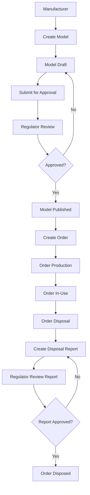
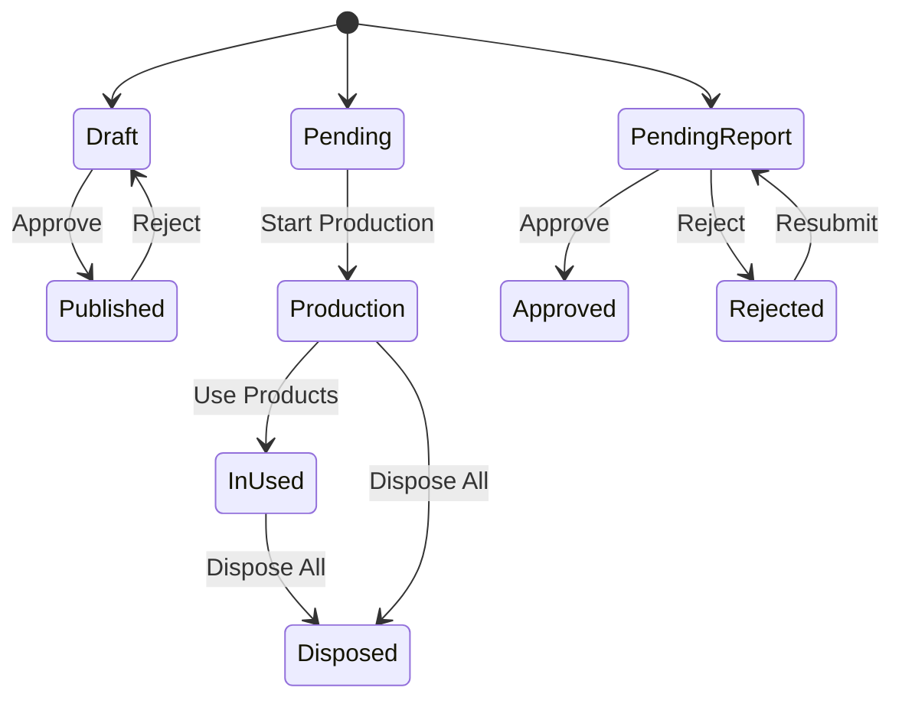
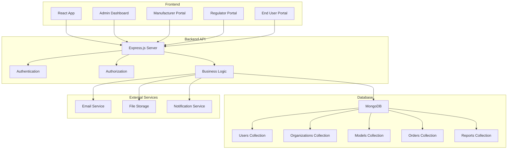
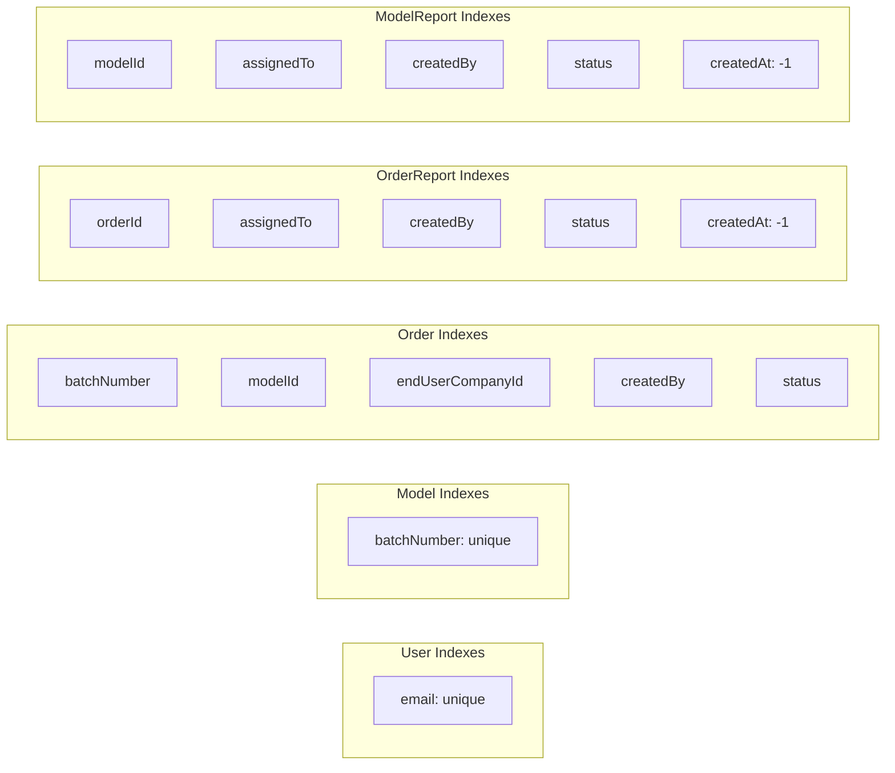
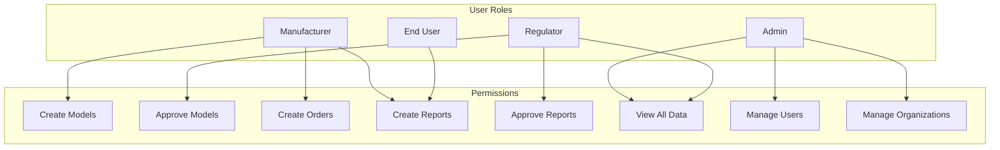
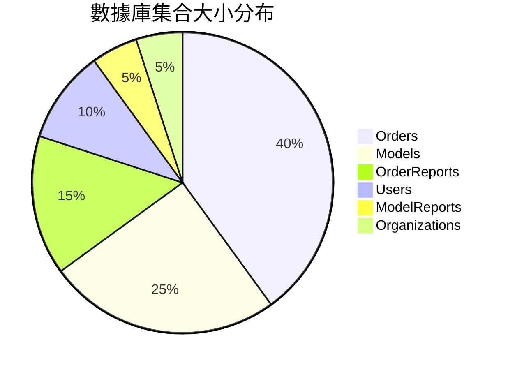
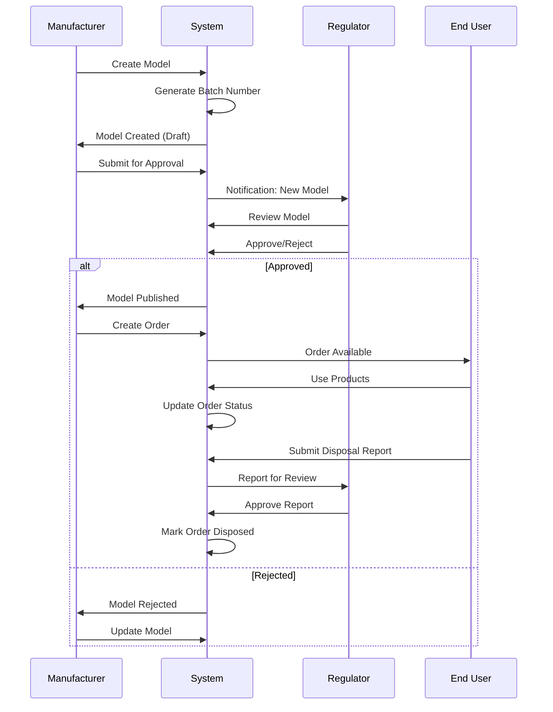

# EOLC Backend - Schema 視覺化圖表

## 📊 數據庫 Schema 關係圖

```mermaid
erDiagram
    User {
        ObjectId _id PK
        String email UK
        String passwordHash
        String role
        ObjectId organizationId FK
        String firstName
        String lastName
        String phone
        String avatarUrl
        Boolean twoFactorEnabled
        String twoFactorSecret
        Array backupCodes
        Boolean emailVerified
        String emailVerificationToken
        Date emailVerificationExpires
        Object settings
        String orgRole
        String status
        Date createdAt
        Date updatedAt
    }

    Organization {
        ObjectId _id PK
        String name
        String type
        String address
        String taxId
        String email
        String contactPhone
        String website
        Array members FK
        String status
        Array invitations
        Date createdAt
        Date updatedAt
    }

    Model {
        ObjectId _id PK
        String modelName
        String modelNumber
        String batchNumber UK
        String description
        Date manufactureDate
        Date expirationDate
        Array standards
        Array classes
        String intendedUseCategories
        String intendedUse
        Object materialComposition
        Object wasteManagement
        String disclaimer
        Array approvers FK
        ObjectId organizationId FK
        ObjectId createdBy FK
        String status
        Date createdAt
        Date updatedAt
    }

    Order {
        ObjectId _id PK
        ObjectId modelId FK
        String batchNumber
        ObjectId endUserCompanyId FK
        String status
        Number producedQuantity
        Number inUseQuantity
        Number disposedQuantity
        Number unusedQuantity
        ObjectId createdBy FK
        Date createdAt
        Date updatedAt
    }

    OrderReport {
        ObjectId _id PK
        String title
        String description
        String status
        ObjectId orderId FK
        ObjectId assignedTo FK
        ObjectId createdBy FK
        String comment
        Number disposalQuantity
        String disposalMethod
        Array evidenceLinks
        Array materials
        String notes
        Date submittedAt
        Date createdAt
        Date updatedAt
    }

    ModelReport {
        ObjectId _id PK
        String title
        String description
        String status
        ObjectId modelId FK
        ObjectId assignedTo FK
        ObjectId createdBy FK
        String comment
        Date createdAt
        Date updatedAt
    }

    %% 關聯關係
    User ||--o{ Organization : "belongs_to"
    User ||--o{ Model : "creates"
    User ||--o{ Order : "creates"
    User ||--o{ OrderReport : "assigned_to"
    User ||--o{ OrderReport : "creates"
    User ||--o{ ModelReport : "assigned_to"
    User ||--o{ ModelReport : "creates"
    
    Organization ||--o{ User : "has_members"
    Organization ||--o{ Model : "owns"
    
    Model ||--o{ Order : "has_orders"
    Model ||--o{ ModelReport : "has_reports"
    
    Order ||--o{ OrderReport : "has_reports"
```

## 🔄 數據流程圖

```mermaid
flowchart TD
    A[Manufacturer] --> B[Create Model]
    B --> C[Model Draft]
    C --> D[Submit for Approval]
    D --> E[Regulator Review]
    E --> F{Approved?}
    F -->|Yes| G[Model Published]
    F -->|No| C
    G --> H[Create Order]
    H --> I[Order Production]
    I --> J[Order In-Use]
    J --> K[Order Disposal]
    K --> L[Create Disposal Report]
    L --> M[Regulator Review Report]
    M --> N{Report Approved?}
    N -->|Yes| O[Order Disposed]
    N -->|No| L
```

## 📈 狀態轉換圖

```mermaid
stateDiagram-v2
    [*] --> Draft
    Draft --> Published : Approve
    Published --> Draft : Reject
    
    [*] --> Pending
    Pending --> Production : Start Production
    Production --> InUsed : Use Products
    InUsed --> Disposed : Dispose All
    Production --> Disposed : Dispose All
    
    [*] --> PendingReport
    PendingReport --> Approved : Approve
    PendingReport --> Rejected : Reject
    Rejected --> PendingReport : Resubmit
```

## 🏗️ 系統架構圖

```mermaid
graph TB
    subgraph "Frontend"
        A[React App]
        B[Admin Dashboard]
        C[Manufacturer Portal]
        D[Regulator Portal]
        E[End User Portal]
    end
    
    subgraph "Backend API"
        F[Express.js Server]
        G[Authentication]
        H[Authorization]
        I[Business Logic]
    end
    
    subgraph "Database"
        J[MongoDB]
        K[Users Collection]
        L[Organizations Collection]
        M[Models Collection]
        N[Orders Collection]
        O[Reports Collection]
    end
    
    subgraph "External Services"
        P[Email Service]
        Q[File Storage]
        R[Notification Service]
    end
    
    A --> F
    B --> F
    C --> F
    D --> F
    E --> F
    
    F --> G
    F --> H
    F --> I
    
    I --> J
    J --> K
    J --> L
    J --> M
    J --> N
    J --> O
    
    I --> P
    I --> Q
    I --> R
```

## 📋 索引結構圖

```mermaid
graph LR
    subgraph "User Indexes"
        A1[email: unique]
    end
    
    subgraph "Model Indexes"
        B1[batchNumber: unique]
    end
    
    subgraph "Order Indexes"
        C1[batchNumber]
        C2[modelId]
        C3[endUserCompanyId]
        C4[createdBy]
        C5[status]
    end
    
    subgraph "OrderReport Indexes"
        D1[orderId]
        D2[assignedTo]
        D3[createdBy]
        D4[status]
        D5[createdAt: -1]
    end
    
    subgraph "ModelReport Indexes"
        E1[modelId]
        E2[assignedTo]
        E3[createdBy]
        E4[status]
        E5[createdAt: -1]
    end
```

## 🔐 權限矩陣

```mermaid
graph TD
    subgraph "User Roles"
        R1[Admin]
        R2[Manufacturer]
        R3[Regulator]
        R4[End User]
    end
    
    subgraph "Permissions"
        P1[Create Models]
        P2[Approve Models]
        P3[Create Orders]
        P4[Create Reports]
        P5[Approve Reports]
        P6[View All Data]
        P7[Manage Users]
        P8[Manage Organizations]
    end
    
    R1 --> P6
    R1 --> P7
    R1 --> P8
    
    R2 --> P1
    R2 --> P3
    R2 --> P4
    
    R3 --> P2
    R3 --> P5
    R3 --> P6
    
    R4 --> P4
```

## 📊 數據統計圖

```mermaid
pie title 數據庫集合大小分布
    "Orders" : 40
    "Models" : 25
    "OrderReports" : 15
    "Users" : 10
    "ModelReports" : 5
    "Organizations" : 5
```

## 🔄 業務流程圖

```mermaid
sequenceDiagram
    participant M as Manufacturer
    participant S as System
    participant R as Regulator
    participant E as End User
    
    M->>S: Create Model
    S->>S: Generate Batch Number
    S->>M: Model Created (Draft)
    
    M->>S: Submit for Approval
    S->>R: Notification: New Model
    R->>S: Review Model
    R->>S: Approve/Reject
    
    alt Approved
        S->>M: Model Published
        M->>S: Create Order
        S->>E: Order Available
        E->>S: Use Products
        S->>S: Update Order Status
        E->>S: Submit Disposal Report
        S->>R: Report for Review
        R->>S: Approve Report
        S->>S: Mark Order Disposed
    else Rejected
        S->>M: Model Rejected
        M->>S: Update Model
    end
``` 